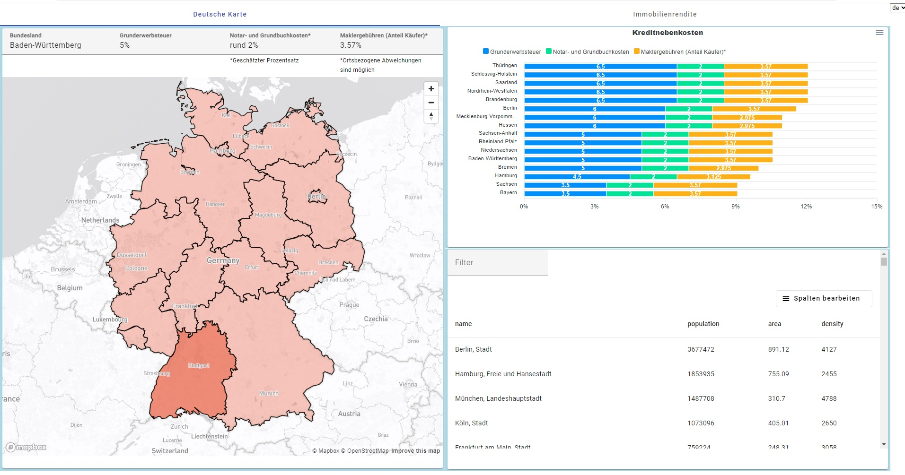
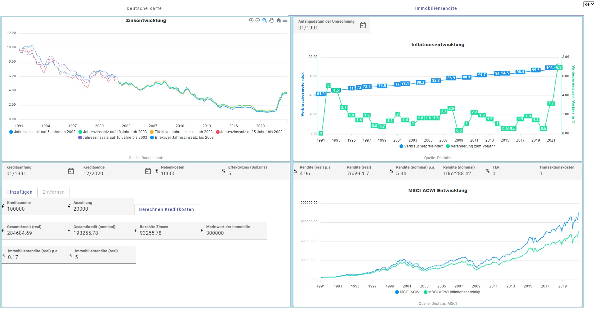
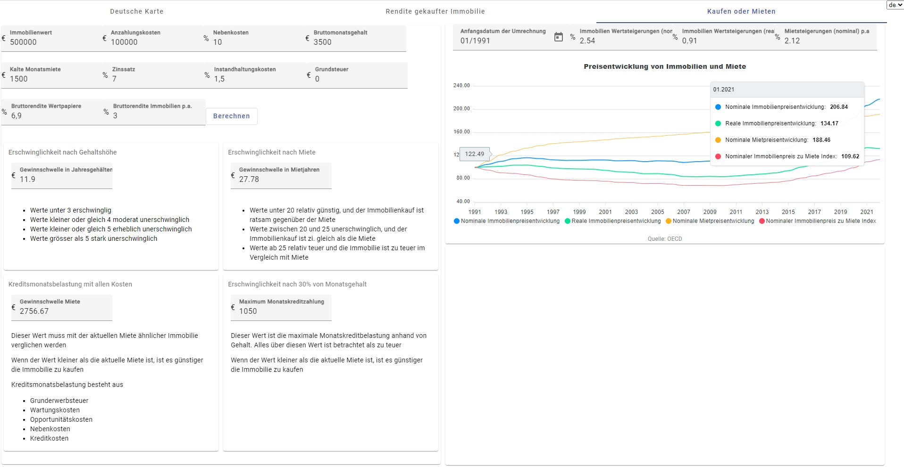

# ReDe

Please pay attention, that this project is still under development and codebase may not satisfy industry standarts

## Installing dependecies

Run `npm install` to istall required libraries i.e.   `npm install -g @angular/cli` istalls Angular CLI 

## Development server

Run `ng serve` for a dev server. Navigate to `http://localhost:4200/`. The app will automatically reload if you change any of the source files.

## Build

Run `ng build` to build the project. The build artifacts will be stored in the `dist/` directory.

## Further help

To get more help on the Angular CLI use `ng help` or go check out the [Angular CLI Overview and Command Reference](https://angular.io/cli) page.

## Docker Image

### Build image

To build image you need to execute  `docker build -t derealestatereturn:1.0 .`, where 
* -t is for tagging the image. 
* derealestatereturn is the name of the image.
* 1.0 is the tag name. If you don’t add any tag, it defaults to the tag named latest.
* . (dot) at the end means, we are referring to the Dockerfile location as the docker build context. That is our current directory.

### Run docker image

Execute `docker run -p 8080:80 --name derealestatereturn:1.0` and go in browser to `http://localhost:8080/`
* -p flag for the port number, the format is local-port:container-port
* -name is a docker image name together with tag
* you can also use -d flag for running the container in detached mode
* or can use --rm to automatically remove container when it exits

## Project description

There are tree tabs. One tab shows German map with statistics about cities and towns together with closing costs for each federal state

Other tab shows historical development of interest rates and inflation starting from 1st of January 1991. And helps to calculate inflation adjusted amount of total price paid for a property and comparison of MSCI ACWI index fund if the same money were invested in the index

The third tab shows development of renting and property prices. Also calculates what is more rational to buy or rent depending on several factors

